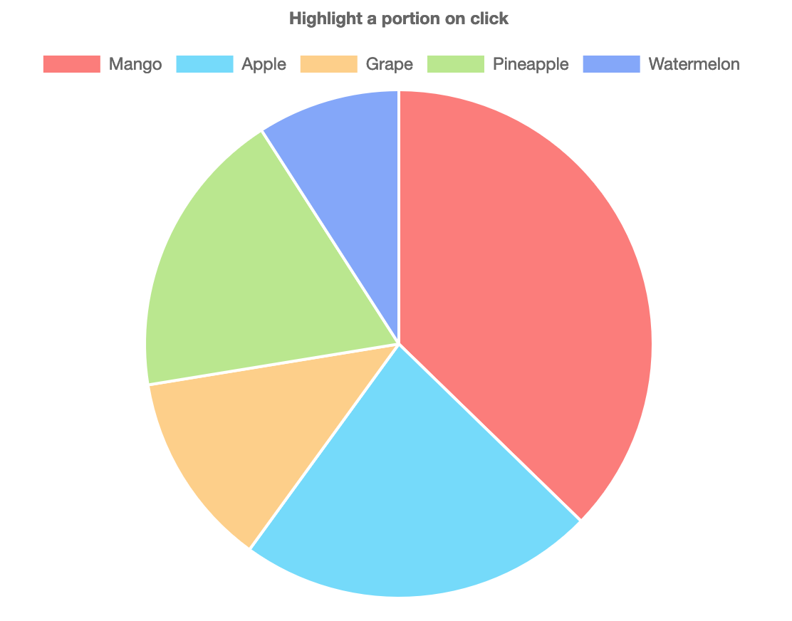
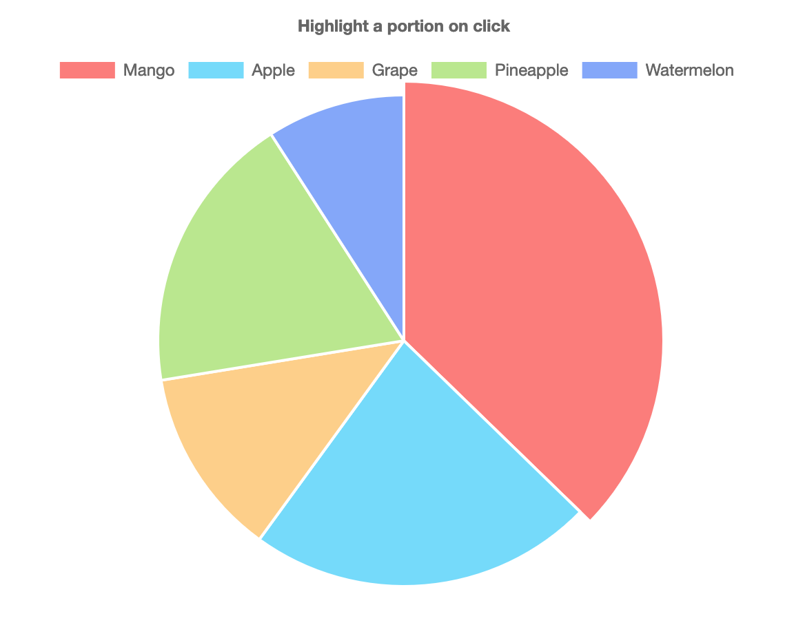

When building a dashboard using Chartjs. The requirement was to highlight a section of doughnut and pie chart on click. The charts were interactive, meaning when you click a portion of doughnut, another chart was getting updated. The highlight is a visual indication to know which portion was currently selected. 

Check out the image below: the red section (Mango) is highlighted after click. Codepen example is attached below for your reference. 

### Solution

Chart.js expose an onClick function to all chart type. onClick pass the current event and an array of active elements. 

```javascript
  options: {
    //other chart options here
    onClick: (evt, item) => {
      //event code goes here
    }
  }
```

Using ```item```, we can access the chart model, which is used by Chart.js internally. We can use this model and increase the outerRadius property to highlight the chart section. 
```outerRadius``` only applies to doughnut and pie. For the bar chart, you can either change the backgroundColor or borderColor to highlight. 


```javascript
  onClick: (evt, item) => {
    item[0]._model.outerRadius += 10;
  }
```

Now, the problem with this approach is, for every click, it will increment the outerRadius by 10. To rest, we can use the inbuilt method ```update()```. In the example below, we use ```pieChart.update();``` on every click to rest the chart to original state and apply an increment to outerRadius. 

### Full example

Link to [Codepen](https://codepen.io/nobalmohan/pen/RvoLZy)


```javascript
var fruitCanvas = document.getElementById("fruitChart");

var fruitData = {
    labels: [
        "Mango",
        "Apple",
        "Grape",
        "Pineapple",
        "Watermelon"
    ],
    datasets: [
        {
            data: [123, 75, 41, 61, 30],
            backgroundColor: [
                "#fd7c78",
                "#70dafc",
                "#fed085",
                "#b9e88b",
                "#82a5fc",
            ]
        }]
};

var options = {
  title: {
    text: "Highlight a portion on click",
  },
  onClick: (evt, item) => {
    pieChart.update();
    item[0]._model.outerRadius += 10;
  }
};

var pieChart = new Chart(fruitCanvas, {
  type: 'pie',
  data: fruitData,
  options: options
});
```






