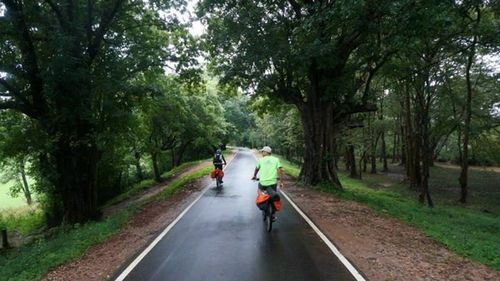
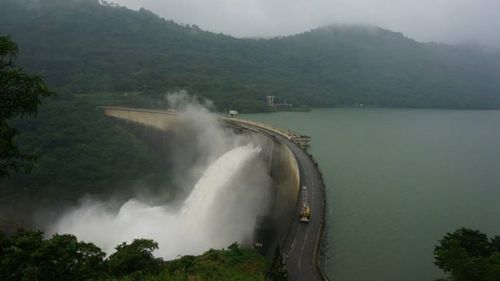
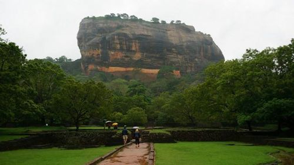
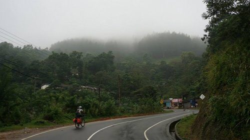
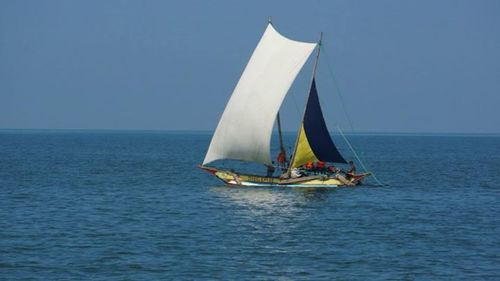

Sri Lanka is a tropical paradise with its lush green forest cover, abundant wildlife and pristine beaches. Years of civil war have kept the country out of tourist map. Now, Sri Lanka is a hotspot in the tourist circuit.

I cycled the country in 2014 for 10 days covering the central highlands. Planning to cover the coastal terrain on my next trip.

This post captures the itinerary and other information in the view of bicycle touring for an Indian national. Though, a lot of points are general information about travelling to Sri Lanka.

### Visa

Visa on arrival for Indians in Sri Lanka. You need to register for an Electronic Travel Authorization ( ETA ) prior to your travel and do an online payment of USD 15 for your visa. International Debit Card, Credit card accepted. You need a local address, a hotel address when you gonna stay to fill the ETA.
Steps:
1: Apply for ETA at the URL mentioned above
2: Make an online payment
3: Carry your ETA printout for visa on arrival at Colombo

### Flight tickets

Plan your flight tickets earlier by at least 3 months. There are frequent flights from Chennai and Colombo is well connected with Tamil Nadu, due to its close proximity. You got flights from Chennai, Madurai and Trichy International airport. Around 1 hour from Chennai to Colombo.

### Customs

Unless if you got your bicycle purchase bill. Go to customs and get your customs declaration quoting your bicycle serial number ( Found on the frame below pedal axle ) else await a drama while return. Go early and with a tape, as you need to open, fill-up custom form with your bike serial number and repack.

### Bicycle packing / luggage

Air India allow 20kg check-in for economy tickets and Sri Lankan airlines allow 30 kg for the same class. Carton pack your cycle, the luggage is handled roughly at airports, so I am not keen on using a bicycle bag. You can drop your carton at the Airport cloakroom or at the hotel you are gonna stay and pick it up later in return.

### Hand baggage

You can carry your panniers as hand baggage up to 7kg permitted. Things NOT allowed as part of Hand baggage: Allen Keys, Bungee cords and Batteries.

### Weather / Clothing / Bags

Sri Lanka is hot and humid due to varying ocean winds. The Hill region is pleasant and cold at nights. Checkout monsoon table and cyclone alerts, there will be heavy downpour during this times and pack your belongings waterproof. Depending on the time of your visit, pick your clothes appropriately. Even during rainy days, the weather is warm. Pack your stuff waterproof and cover your panniers with a poncho and hook a bungee on either side. http://en.wikipedia.org/wiki/Sri_Lanka#Geography

### Money

Card payments are not in wide use apart from big cities. Carry USD for monuments tickets and Others in Sri Lankan rupee. You can use your International Debit Card for card payments and ATM withdrawal.

### Monument and National Parks

You need to buy a ticket for all archaeological sites. For SAARC nationalities it’s half-price for monuments. National parks have timings and no special discount for SAARC nations. You should cover your knee and shoulder while entering certain Buddhist places. Facing your head toward Buddha and taking pictures is not allowed. You need to remove your shoe in some places to enter the temple.

### Food

Carry dry fruits and energy bars. It not easily available and priced triple times what you pay back home. You get banana, pineapple and watermelon and oranges throughout the country.

### Stay

Hotels are less in the countryside. Carry your own tent. Don’t pitch in the forest area. Sri Lanka has a healthy wildlife population, particularly elephants and leopard. People are friendly and allow you to pitch a tent near the house. They speak only Shingala or Tamil, better carry a picture of anything you want of convey. We had a hard time explaining tent to them.

### [Our gallery](https://www.facebook.com/PeterVanGeit/media_set?set=a.10204943433208231.1073741994.1312929832&type=1)

### Suggested route for central Sri Lanka

Negombo - Waikkal - Kurunegala - Dambulla - Sigiriya - Giritale - Polonnaruwa - Pallegama - Mahiyanganaya - Victoria Randenigala Rantembe Sanctuary - Kandy - Ginigathena - Hatton - Norton bridge - Maskeliya - Northwood - Hatton - Nuwara Eliya - Horton plain National Park - Haputale - Belihuloya - Udawalawe National Park - Tangalle - Matara - Galle

### Final Checklist

Documents:

- Passport: Original
- Driving License or PAN card: Original ( Optional / Backup )
- Flight Ticket printout
- ETA printout
- Passport Photocopy: 2 copy ( Optional / Backup )
  Money:
- Take US dollars in cash
- Forex card / credit card / International debit card
  Cycle:
- Spanner 14-5 for pedals
- Spare tube
- Puncture kit
- Allen keys
- Spare screw: the one you use in bottle holders, carrier
- Chain links, Chain link tool
- Hydration bag: Most important
- Bandanna/ Hand/leg warmers
- Cap
- Sunglasses
- Lights
- Panniers: get the smallest one
- Handlebar - optional
- Gloves
- Padded shorts
- Spray: Small Zorrik 88 or WD 40
- Fully serviced bike
- Bungee cord
- Poncho
- Rain jacket
- Ziplock bags
- Lock
- Water bottles
  Gadgets:
- Camera
- Camera batteries / batteries charger
- Travel adapter
- GPS / GPS cable
- Batteries for GPS
- Swiss knife
  Toiletries / Clothes:
- Toilet roll
- Toothbrush/paste
- Odomos: Mosquito repellent
- Liquid face wash: for bathing too
- Flipflops
- Sleeping bag
- Tent
- Spoon
- 2 t-shirts / 2 Shorts / one trousers
- Small quick dry towel
- 2 pairs of socks

Food:

- Dry fruits
- Energy bars or Snickers
- Electrol
